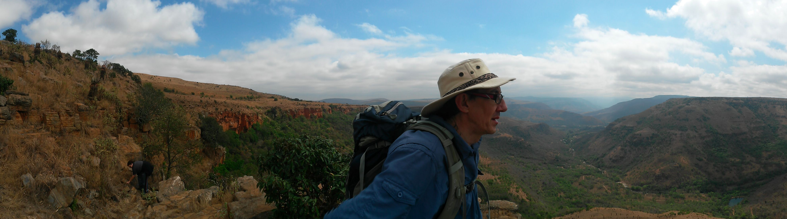

= Fast JVM Development & Testing
Schalk W. Cronjé
:sessiondir: ./

== About me

* Email: ysb33r@gmail.com
* Twitter / Ello : @ysb33r

== About the Materials

All materials are on the USB that has been supplied to you.

== Setup

=== JDK Installation

A JDK needs to be installed and `JAVA_HOME` needs to be set in the environment. We assume that you know how to set
environmental variables for your operating system. If you do not have a JDK installed, it van be done via hte local
package manager or downloaded from the http://www.oracle.com/technetwork/java/javase/downloads/index.html[Oracle website].
Please ensure that you have a JDK installed and not just a JRE.

== Part One : Learning Groovy

Please open link:{sessiondir}/ftjd-part-one.html[Part One]

== Part Two : Build & Test Pipeline

Please open link:{sessiondir}/ftjd-part-two.html[Part Two]

////
== Part Three : Expressive Testing Foundations

Please open link:{sessiondir}/ftjd-part-three.html[Part Three]

== Part Four : Quick HTTP testing

== Part Five : Offline testing

== Part Six : Web UI testing

== Part Seven : Open Session

////

