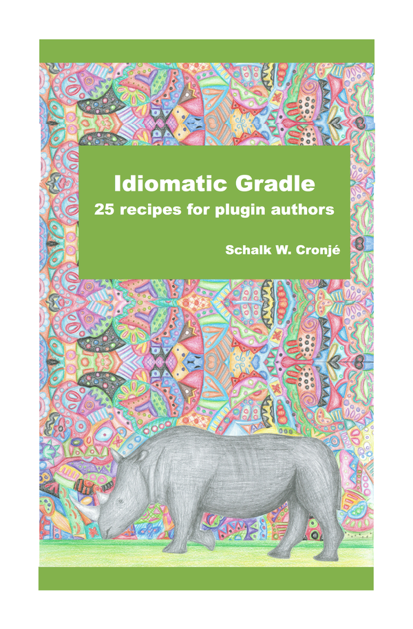
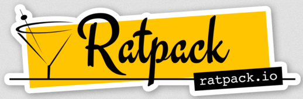
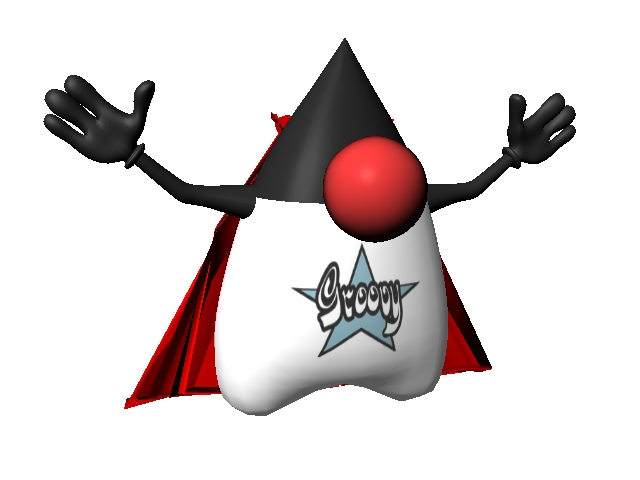
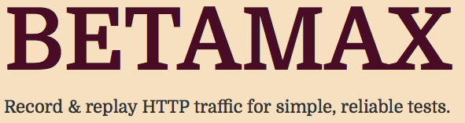

= Cool JVM Tools to Help you Test
:author: Schalk W. Cronjé
:email: ysb33r@gmail.com
:twitter: @ysb33r
:docinfo2:
:revealjs_keyboard: true
:revealjs_overview: true
:revealjs_theme: solarized
:revealjs_controls: true
:revealjs_history: true
:revealjs_slideNumber : true
:revealjs_center: false
:icons: font
:srcmaindir: ../../../main/groovy/fasttrackjvm
:srctestdir: ../../../test/groovy/fasttrackjvm
:srcbetamaxdir:  ../../../betamaxTest/groovy/fasttrackjvm
:prezzodir: ../../../..
coderay-css: stylesheets/asciidoctor-coderay.css

[NOTE.speaker]
--
Doos(a)re din mei(n) aapka svaagat hai
--

== About me

* Email: ysb33r@gmail.com
* Twitter / Ello : @ysb33r

image::images/SchalkPanarama.jpg[]

== Technical Tester

* Work on coding skills
* Think
* Be open-minded
* Testing is even more important that development.

// Spock
include::spock/spock-intro.adoc[]

include::spock/spock-links.adoc[leveloffset=+1]

// Groovy
include::groovy/groovy-intro.adoc[]

// TestHttpClient
include::ratpack/http-testing.adoc[]

include::ratpack/ratpack-intro.adoc[]

include::ratpack/ratpack-test-links.adoc[leveloffset=+1]

// Betamax

include::betamax/offline-api-testing.adoc[]

include::betamax/betamax-intro.adoc[]

include::betamax/betamax-links.adoc[leveloffset=+1]

// Geb

include::geb/website-testing.adoc[]

include::geb/geb-intro.adoc[]

include::geb/geb-links.adoc[leveloffset=+1]

// Gradle

== Tie it together

* Automation is very important for effectiveness and time-to-market
* Ability to run all tests locally, under CI and under special environments
* Modern testers needs to know about deployment

include::gradle/gradle-intro.adoc[]

include::gradle/gradle-links.adoc[leveloffset=+1]

== DEMO

== {nbsp}

http://leanpub.com/idiomaticgradle

== About this presentation

* Written in Asciidoctor ({asciidoctorj})
* Styled by asciidoctor-revealjs extension
* Built using:
** Gradle
** gradle-asciidoctor-plugin
** gradle-vfs-plugin
* All code snippets tested as part of build

== Thank you धन्यवाद

Schalk Cronjé

ysb33r@gmail.com

@ysb33r

image:images/geb-logo.svg[height=20%,width=20%]

