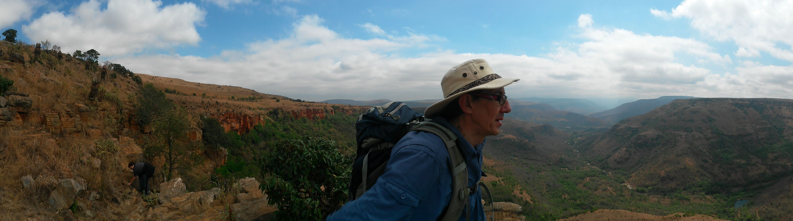

= Cool JVM Tools to Help you Test
:author: Schalk W. Cronjé
:email: ysb33r@gmail.com
:twitter: @ysb33r
:docinfo2:
:revealjs_keyboard: true
:revealjs_overview: true
:revealjs_theme: beige
:revealjs_controls: true
:revealjs_history: true
:revealjs_slideNumber : true
:revealjs_center: false
:icons: font
:srcmaindir: ../../../main/groovy/fasttrackjvm
:srctestdir: ../../../test/groovy/fasttrackjvm
:projectdir: ../../../..
coderay-css: stylesheets/asciidoctor-coderay.css

== About me

* Email: ysb33r@gmail.com
* Twitter / Ello : @ysb33r

// == Unit testing

// Spock
include::spock/spock-intro.adoc[]

include::spock/spock-links.adoc[leveloffset=+1]

// Groovy
// Geb
// Betamax
// Gradle
// Docker for everything ?

== Demo

== Today's Cool Tools

* Betamax
* Geb
* Gradle
* Ratpack
* Spock Framework

== About this presentation

* Written in Asciidoctor ({asciidoctorj})
* Styled by asciidoctor-revealjs extension
* Built using:
** Gradle
** gradle-asciidoctor-plugin
** gradle-vfs-plugin
