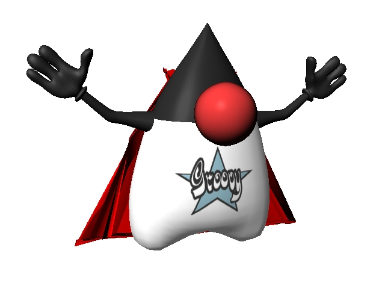

= Using the Groovy Ecosystem for Rapid JVM Development
:author: Schalk W. Cronjé
:email: ysb33r@gmail.com
:twitter: @ysb33r
:docinfo1:
:revealjs_keyboard: true
:revealjs_overview: true
:revealjs_theme: beige
:revealjs_controls: false
:revealjs_history: true
:revealjs_slideNumber : true
:revealjs_center: false
:icons: font
:srcmaindir: ../../../main/groovy/fasttrackjvm
:srctestdir: ../../../test/groovy/fasttrackjvm
:projectdir: ../../../..
coderay-css: stylesheets/asciidoctor-coderay.css

== About me

* Email: ysb33r@gmail.com
* Twitter / Ello : @ysb33r

image::images/SchalkPanarama.jpg[]

// Groovy

== {nbsp}

// Gradle

// Spock
include::spock/spock-intro.adoc[]

include::spock/spock-links.adoc[leveloffset=+1]

// Geb
// Ratpack
// Grails

== About this presentation

* Written in Asciidoctor ({asciidoctorj})
* Styled by asciidoctor-revealjs extension
* Built using:
** Gradle
** gradle-asciidoctor-plugin
** gradle-vfs-plugin
* All code snippets tested as part of build